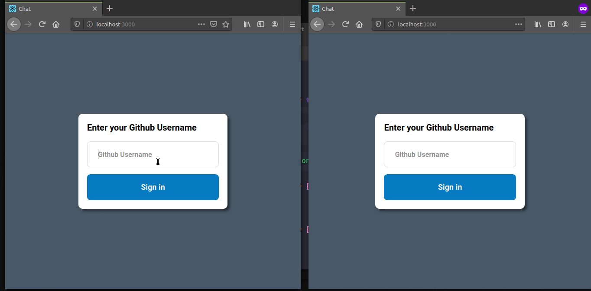

<h2 align="center"> Real-time-Chat</h2>

## :gear: Technologies
- [Node.js](https://nodejs.org/en/)
- [React](https://reactjs.org)
- [socket.io-client](https://www.npmjs.com/package/socket.io-client)
- [ESlint](https://eslint.org/)
- [Styled-Components](https://styled-components.com/)

## :checkered_flag: To run the project:
1. Make a clone (`git clone`) of this repository;
2. Enter the `cd real-time-Chat` folder;

## Backend
1. Enter the `cd backend` folder;
2. Run `yarn` to install the dependencies;
3. Run `yarn start` to start the server.

## Web 
1. Enter the `cd front` folder;
2. Run `yarn` to install the dependencies;
3. Run `yarn start` to start the server.

